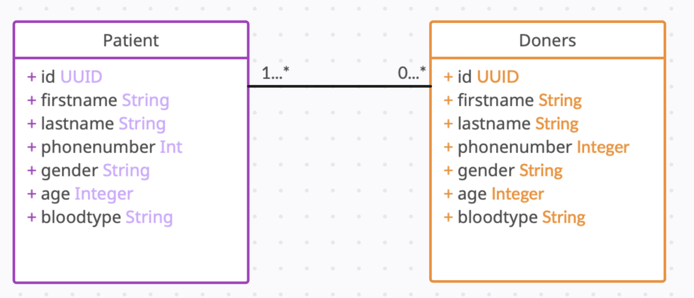
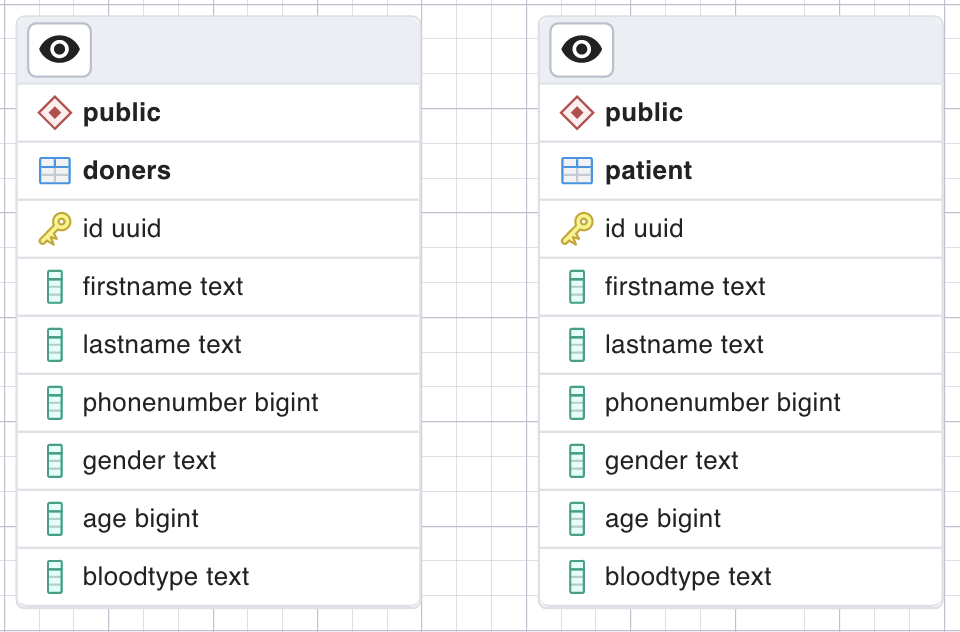

# 🩸💉BloodDonationAPI

  

## SOLUTION CONCEPT
Blood Donation System Database Project to help blood bank to handel the data of the patients and donor

## Data 
our data is made of to tables (Patient - Donor)

## Patient 
- name
- id
- phone number
- gender
- blood type
- hospital
- city

## Donor 
- name
- id
- phone number
- gender
- blood type
- city

## Feature List Deconstruction
### CRUD actions 
- Create
- Read
- Update
- Delete

## Database Schem
### UML diagram:
<h3>     

### ER diagram:
<h3>    

## Tools
[![Xcode][Xcode-img]][Xcode-url]   [![Postman][Postman-img]][Postman-url]  [![Postgres][Postgres-img]][Postgres-url]  [![pgAdmin][pgAdmin-img]][pgAdmin-url]  [![postico2][postico2-img]][postico2-url]   [![Xcode][xcode-img]][xcode-url]

## Team

  <a href="https://www.linkedin.com/in/lujean-alradhi-72b417209/">Lujeen Alradhi</a>
  
  
  <a href="https://www.linkedin.com/in/randalmuhanna/">Rand AlMuhanna </a>
  
  
  <a href="https://www.linkedin.com/in/rand-alhassoun-b067b91a3/">Rand Alhassoun </a>

<!-- MARKDOWN LINKS & IMAGES -->

<!-- https://www.markdownguide.org/basic-syntax/#reference-style-links -->

[Xcode-img]: https://img.shields.io/badge/-SwiftUI-blue
[Xcode-url]: https://developer.apple.com/xcode/swiftui/

[Postman-img]: https://img.shields.io/badge/-Postman-yellow
[Postman-url]: https://www.postman.com

[Postgres-img]: https://img.shields.io/badge/-Postgres-blue
[Postgres-url]: https://www.postgresql.org

[pgAdmin-img]: https://img.shields.io/badge/-pgadmin-yellow
[pgAdmin-url]: https://www.pgadmin.org

[postico2-img]: https://img.shields.io/badge/-pgadmin-blue
[postico2-url]: https://www.pgadmin.org](https://eggerapps.at/postico2/

[xcode-img]: https://img.shields.io/badge/-pgadmin-yellow
[xcode-url]: https://developer.apple.com/support/xcode/

